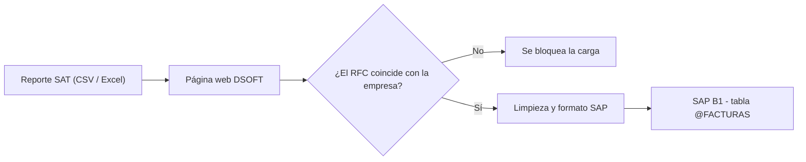

# 📘 Guía completa: DSOFT – Carga de Facturas SAT a SAP B1

Esta guía está escrita para personas **sin experiencia en programación**. Sigue los pasos en orden.

---

## Índice

1. [¿Qué hace esta aplicación?](#1-qué-hace-esta-aplicación)
2. [Lo que necesitas antes de empezar](#2-lo-que-necesitas-antes-de-empezar)
3. [Instalación en el servidor (una sola vez)](#3-instalación-en-el-servidor-una-sola-vez)
4. [Permitir que otras computadoras entren a la web](#4-permitir-que-otras-computadoras-entren-a-la-web)
5. [Hacer que la app arranque sola al encender el servidor](#5-hacer-que-la-app-arranque-sola-al-encender-el-servidor)
6. [Cómo usar la web (usuarios finales)](#6-cómo-usar-la-web-usuarios-finales)
7. [Cómo revertir una carga equivocada (rollback)](#7-cómo-revertir-una-carga-equivocada-rollback)
8. [Mantenimiento: qué hacer y cada cuándo](#8-mantenimiento-qué-hacer-y-cada-cuándo)
9. [Solución de problemas](#9-solución-de-problemas)
10. [Cambios comunes (empresas y campos)](#10-cambios-comunes-empresas-y-campos)
11. [Estructura del proyecto y seguridad](#11-estructura-del-proyecto-y-seguridad)

---

## 1. ¿Qué hace esta aplicación?

Es una página web interna. Sirve para tomar el reporte de facturas que se descarga del SAT (CSV o Excel) y guardarlo en la tabla **@FACTURAS** de SAP Business One.



**Qué hace automáticamente:**

| Función | Explicación sencilla |
|---|---|
| ✅ Valida la empresa | Si subes el archivo de otra empresa por error, la app lo detecta y no deja continuar. |
| ✅ No pierde historial | Sube facturas **Vigentes y Canceladas**. |
| ✅ Convierte fechas | `29/12/2025` → `2025-12-29`, que es el formato que pide SAP. Las fechas vacías se mandan vacías. |
| ✅ Sin duplicados | Si la factura (UUID) ya existe en SAP, la **actualiza**. Si no existe, la **crea**. Puedes subir el mismo archivo dos veces sin duplicar nada. |
| ✅ Trazabilidad | Cada carga recibe un **Batch ID** (ej. `LOTE_20261005_0830`) que se guarda en SAP. |
| ✅ Botón de deshacer | Con el Batch ID puedes borrar de SAP lo que creó una carga equivocada. |

---

## 2. Lo que necesitas antes de empezar

- [ ] Un **servidor o PC con Windows** que esté siempre encendido y en la red de la oficina.
- [ ] **Acceso a internet** desde ese servidor (para llegar al SAP en la nube).
- [ ] Los **datos de SAP**: URL de Service Layer, base de datos, usuario y contraseña. Ya están en el archivo `.env` de la PC donde se desarrolló.
- [ ] Acceso a la cuenta de GitHub **JAGA894**, donde está el código (repositorio privado).

---

## 3. Instalación en el servidor (una sola vez)

### Paso 3.1 – Instalar Python

1. Entra a <https://www.python.org/downloads/> y descarga la versión más reciente para Windows.
2. Abre el instalador.
3. ⚠️ **MUY IMPORTANTE:** abajo, marca la casilla **"Add python.exe to PATH"**.
4. Elige **"Customize installation"** → **Next** → marca **"Install Python for all users"** → **Install**.
5. Para comprobarlo, abre **PowerShell** (botón Inicio → escribe `PowerShell` → Enter) y escribe:
   ```powershell
   python --version
   ```
   Debe aparecer algo como `Python 3.14.x`.

### Paso 3.2 – Instalar Git

1. Descarga Git desde <https://git-scm.com/download/win>.
2. Instálalo con todas las opciones por defecto (solo da **Next** hasta terminar).

### Paso 3.3 – Descargar el proyecto

1. Crea una carpeta para aplicaciones, por ejemplo `C:\Apps`.
2. En PowerShell escribe:
   ```powershell
   cd C:\Apps
   git clone https://github.com/JAGA894/dsoft-carga-facturas-sap.git
   cd dsoft-carga-facturas-sap
   ```
3. Como el repositorio es **privado**, aparecerá una ventana para iniciar sesión en GitHub. Entra con la cuenta **JAGA894**.

### Paso 3.4 – Ejecutar el instalador

1. Abre la carpeta `C:\Apps\dsoft-carga-facturas-sap` en el Explorador de archivos.
2. Haz **doble clic** en **`instalar.bat`**.
3. El instalador hará esto solo:
   - Crea un entorno aislado de Python (carpeta `venv`).
   - Instala las librerías necesarias.
   - Crea el archivo `.env` y lo abre en el Bloc de notas.

### Paso 3.5 – Llenar el archivo `.env`

En el Bloc de notas que se abrió, reemplaza los valores con los datos reales de SAP:

```ini
SAP_URL=https://<servidor-service-layer>/b1s/v1
SAP_COMPANYDB=SA_PRODUCTIVA
SAP_USER=<usuario SAP>
SAP_PASSWORD=<contraseña SAP>
SAP_UDT=FACTURAS
```

> [!TIP]
> Lo más sencillo es copiar el archivo `.env` de la PC donde se desarrolló (ya tiene los datos correctos) a la carpeta del servidor.

Guarda (**Ctrl + G** o **Ctrl + S**) y cierra el Bloc de notas. Al final, el instalador ejecuta una verificación automática.

### Paso 3.6 – Verificar la conexión con SAP

Si quieres repetir la verificación en cualquier momento, ejecuta en PowerShell, dentro de la carpeta del proyecto:

```powershell
venv\Scripts\python verificar_sap.py
```

El resultado correcto se ve así:

```text
[ OK ] .env cargado
[ OK ] Login correcto
[ OK ] La tabla @FACTURAS existe (endpoint /U_FACTURAS)
[ OK ] Todos los campos del mapeo existen en SAP (24)
[ OK ] El campo U_BatchID existe (rollback disponible)
 Todo en orden. La aplicación puede cargar datos a SAP.
```

> [!NOTE]
> Si apuntas a **otra base de datos SAP** (por ejemplo, una de pruebas), ejecuta una vez `venv\Scripts\python verificar_sap.py --crear-campos`. Así se crea el campo `U_BatchID` en esa base. En `SA_PRODUCTIVA` ya está creado.

### Paso 3.7 – Iniciar la aplicación

1. Haz **doble clic** en **`iniciar_app.bat`**.
2. Se abrirá una ventana negra. **No la cierres**: si la cierras, la página deja de funcionar.
3. En el navegador del servidor entra a: **<http://localhost:8501>**

---

## 4. Permitir que otras computadoras entren a la web

1. Averigua la IP del servidor. En PowerShell escribe `ipconfig` y busca **"Dirección IPv4"**, por ejemplo `192.168.0.150`.
2. Abre el puerto 8501 en el firewall de Windows. Abre **PowerShell como Administrador** (clic derecho → *Ejecutar como administrador*) y escribe:
   ```powershell
   netsh advfirewall firewall add rule name="DSOFT Carga SAP 8501" dir=in action=allow protocol=TCP localport=8501
   ```
3. Desde cualquier PC de la oficina, entra a: **`http://192.168.0.150:8501`** (usa la IP de tu servidor).

> [!CAUTION]
> La aplicación **no tiene usuario ni contraseña propios**. Úsala **solo dentro de la red de la oficina**. **Nunca** abras el puerto 8501 en el router o módem hacia internet.

---

## 5. Hacer que la app arranque sola al encender el servidor

Así no tendrás que hacer doble clic en `iniciar_app.bat` cada vez que se reinicie el servidor.

**Opción con comando** (PowerShell como **Administrador**; ajusta la ruta si instalaste en otra carpeta):

```powershell
schtasks /Create /TN "DSOFT Carga SAP" /TR "\"C:\Apps\dsoft-carga-facturas-sap\iniciar_app.bat\"" /SC ONSTART /RU SYSTEM /RL HIGHEST /F
```

**Opción gráfica** (Programador de tareas):

1. Inicio → escribe **"Programador de tareas"** → ábrelo.
2. **Crear tarea básica…** → Nombre: `DSOFT Carga SAP`.
3. Desencadenador: **Al iniciar el equipo**.
4. Acción: **Iniciar un programa** → selecciona `C:\Apps\dsoft-carga-facturas-sap\iniciar_app.bat`.
5. Al terminar, abre las **Propiedades** de la tarea y marca:
   - **"Ejecutar tanto si el usuario inició sesión como si no"**
   - **"Ejecutar con los privilegios más altos"**

**Comandos útiles:**

| Acción | Comando (PowerShell como Administrador) |
|---|---|
| Iniciar ahora | `schtasks /Run /TN "DSOFT Carga SAP"` |
| Detener | `schtasks /End /TN "DSOFT Carga SAP"` |
| Eliminar la tarea | `schtasks /Delete /TN "DSOFT Carga SAP" /F` |

Para comprobar que funciona, reinicia el servidor y entra a `http://localhost:8501`.

---

## 6. Cómo usar la web (usuarios finales)

### Paso a paso

| Paso | Qué hacer | Qué verás |
|---|---|---|
| **1** | Elige la **empresa** en la lista desplegable. | — |
| **2** | Arrastra o selecciona el **reporte del SAT** (`.csv` o `.xlsx`). | ✅ *"RFC verificado"* o ❌ *"El archivo no pertenece a la empresa…"* |
| **3** | Revisa la tabla con los datos ya convertidos al formato SAP. | Número de registros, Batch ID y conteo por estatus. |
| *(opcional)* | Presiona **"🔍 Generar Payload de Prueba"**. | Los primeros 3 registros tal como llegarán a SAP. |
| **4** | Presiona **"🚀 Subir datos a SAP B1"**. | Barra de progreso registro por registro. |
| **5** | Revisa el resultado. | **Creados / Actualizados / Errores**. Si hubo errores, se muestra el detalle. |
| **6** | **Anota el Batch ID** que aparece al final. | Ej. `LOTE_20261005_0830` |

### Reglas del archivo

- Las **primeras 4 filas** del reporte (título, empresa, periodo…) se ignoran automáticamente.
- Columnas **obligatorias**: `UUID`, `Sello`, `SAT`, `Estatus`, `Emisión`, `Total`, y `Emisor RFC` o `Receptor RFC`.
- Columnas **opcionales**: se envían solo si vienen en el archivo. Son `Fecha Cancelación`, `Ver`, `Tipo`, `Serie`, `Folio`, `Uso CFDI`, `Emisor RFC`, `Emisor Nombre`, `Conceptos Descripcion`, `Subtotal`, `Descuento`, `IVA`, `Impuesto Local`, `IVA Retenido`, `ISR Retenido`, `Impuesto Local R`, `Tipo Cambio`, `Forma Pago` y `Metodo Pago`.
- Cualquier otra columna se **ignora**.
- Las filas sin UUID y los UUID repetidos dentro del archivo se descartan, y la app te avisa cuántos fueron.

### ¿Cómo valida la empresa?

Toma el primer RFC del archivo y lo compara con el de la empresa elegida:

- Si coincide con el **Emisor RFC**, significa que son facturas **emitidas** por la empresa.
- Si coincide con el **Receptor RFC**, significa que son facturas **recibidas** de proveedores.

Si no coincide con ninguno, la carga se bloquea.

> [!IMPORTANT]
> Para cargar **facturas recibidas**, el reporte debe incluir la columna **`Receptor RFC`**. En esas facturas el emisor es el proveedor, así que sin esa columna la validación las rechazará.

### ¿Se puede subir el mismo archivo dos veces?

**Sí.** La segunda vez las facturas solo se **actualizan** y no se duplica nada. Esto es útil, por ejemplo, para actualizar facturas que pasaron de *Vigente* a *Cancelado*.

---

## 7. Cómo revertir una carga equivocada (rollback)

1. En la **barra lateral izquierda** de la web, busca **"🧯 Revertir un lote"**.
2. Escribe el **Batch ID** de la carga (ej. `LOTE_20261005_0830`). Si acabas de subir algo, ya aparece escrito.
3. Marca **"Confirmo que quiero eliminar este lote de SAP"**.
4. Presiona **"🗑️ Eliminar lote"**.

> [!WARNING]
> El rollback borra **solo las facturas que ese lote CREÓ**. Las facturas que ya existían y solo se **actualizaron** **no se borran**; esto protege tu historial. Si una actualización quedó mal, vuelve a subir el archivo correcto y los datos se corregirán.

> [!NOTE]
> El Batch ID cambia cada minuto. Si se hacen dos cargas **diferentes** en el mismo minuto, compartirán el mismo Batch ID y un rollback borraría ambas.

---

## 8. Mantenimiento: qué hacer y cada cuándo

| Frecuencia | Tarea | Cómo |
|---|---|---|
| **Diario** | Nada obligatorio. | La app solo se conecta a SAP mientras dura una carga y cierra la sesión al terminar, así que no deja licencias ocupadas. |
| **Cuando cambie la contraseña de SAP** | Actualizar `.env`. | Edita `SAP_PASSWORD` en `.env` con el Bloc de notas y reinicia la app (sección 5, "Detener" e "Iniciar ahora"). |
| **Cuando haya cambios en el código** | Descargar la versión nueva. | En PowerShell, dentro de la carpeta: `git pull` y luego reinicia la app. |
| **Cada 3 meses** (recomendado) | Actualizar librerías. | `venv\Scripts\pip install -U -r requirements.txt`. Después ejecuta `venv\Scripts\python verificar_sap.py` y prueba subir un archivo pequeño. |
| **Cada 3 meses** | Revisar que el respaldo de SAP esté al día. | Lo hace el administrador de SAP / proveedor de la nube. |
| **Cuando caduque el token de GitHub** | Generar uno nuevo. | Solo hace falta para `git pull`. GitHub → Settings → Developer settings → Personal access tokens. |
| **Si se reinicia el servidor** | Nada, si configuraste la sección 5. | Si no la configuraste, haz doble clic en `iniciar_app.bat`. |

---

## 9. Solución de problemas

| Síntoma | Causa probable | Solución |
|---|---|---|
| La página no abre (`localhost:8501`) | La app no está corriendo. | Ejecuta `iniciar_app.bat` o `schtasks /Run /TN "DSOFT Carga SAP"`. |
| Abre en el servidor pero no desde otras PCs | Firewall bloqueado. | Repite el paso 4.2. Verifica la IP con `ipconfig`. |
| ❌ *"Faltan variables en el archivo .env"* | `.env` incompleto o no existe. | Revisa el paso 3.5. |
| ❌ *"Error al autenticar… código SAP -304"* o *"Invalid user"* | Usuario o contraseña incorrectos, o la contraseña cambió. | Corrige `.env` y reinicia la app. |
| ❌ *"No se pudo conectar con SAP"* | Sin internet, o el servidor SAP está caído. | Prueba abrir la URL de SAP en el navegador. Contacta al proveedor de SAP. |
| ❌ *"El archivo no pertenece a la empresa seleccionada"* | Elegiste otra empresa o subiste otro archivo. | Revisa ambos. Si son facturas **recibidas**, el reporte debe traer `Receptor RFC`. |
| ❌ *"Columnas obligatorias faltantes"* | El reporte cambió de formato o no es el reporte correcto. | Revisa que el archivo tenga las columnas de la sección 6. |
| Aparecen fechas vacías en SAP | La fecha venía vacía o con un formato no reconocible. | Revisa la columna en el archivo original. |
| ⚠️ Algunos registros con error al subir | Un dato no cabe en el campo de SAP (ej. texto muy largo). | Abre *"Ver detalle de errores"*: indica el UUID y el motivo. |
| ❌ *"No module named …"* | No se instalaron las librerías. | Ejecuta `instalar.bat` otra vez. |
| La ventana negra se cierra sola | Error al iniciar. | Abre PowerShell en la carpeta y ejecuta `venv\Scripts\python -m streamlit run app.py` para ver el mensaje. |

**Para revisar el sistema completo**, ejecuta:

```powershell
venv\Scripts\python verificar_sap.py
```

---

## 10. Cambios comunes (empresas y campos)

### Agregar o cambiar una empresa

1. Abre `app.py` con el Bloc de notas (o VS Code).
2. Busca `EMPRESAS_RFC = {` y agrega una línea con el mismo formato:
   ```python
   "NUEVA EMPRESA SA DE CV":         "NEM123456AB1",
   ```
3. Guarda y reinicia la app.

### Enviar una columna nueva a SAP

1. En SAP, crea el campo en la tabla `@FACTURAS`. Por ejemplo, el campo `Moneda` aparecerá en Service Layer como `U_Moneda`.
2. En `procesador.py`, agrega una línea dentro de `MAPEO_OPCIONAL`:
   ```python
   "Moneda": "U_Moneda",
   ```
3. Ejecuta `venv\Scripts\python verificar_sap.py`. Debe decir que todos los campos existen.
4. Reinicia la app.

---

## 11. Estructura del proyecto y seguridad

```text
dsoft-carga-facturas-sap/
├── app.py               ← Página web (lo que ve el usuario)
├── procesador.py        ← Limpieza y conversión de datos (pandas)
├── sap_api.py           ← Conexión con SAP Service Layer
├── verificar_sap.py     ← Diagnóstico de conexión
├── instalar.bat         ← Instalación (una vez)
├── iniciar_app.bat      ← Arranque de la app
├── requirements.txt     ← Librerías necesarias
├── .env.example         ← Plantilla de configuración (sin contraseñas)
├── .env                 ← Configuración REAL (NO se sube a GitHub)
├── .streamlit/config.toml
├── tests/               ← Pruebas automáticas
└── docs/GUIA_DE_USO.md  ← Esta guía
```

**Reglas de seguridad:**

- 🔒 El archivo `.env` (contraseña de SAP) **nunca** se sube a GitHub; `.gitignore` lo bloquea.
- 🔒 Los archivos `.csv` y `.xlsx` (datos fiscales) **nunca** se suben a GitHub.
- 🔒 El repositorio de GitHub es **privado**.
- 🔒 La app solo se debe usar dentro de la red interna.
- 🔒 Si un token o contraseña se comparte por chat o correo, **revócalo y genera uno nuevo**.

**Para desarrolladores – ejecutar las pruebas automáticas:**

```powershell
venv\Scripts\pip install -r requirements-dev.txt
venv\Scripts\python -m pytest -v
```
